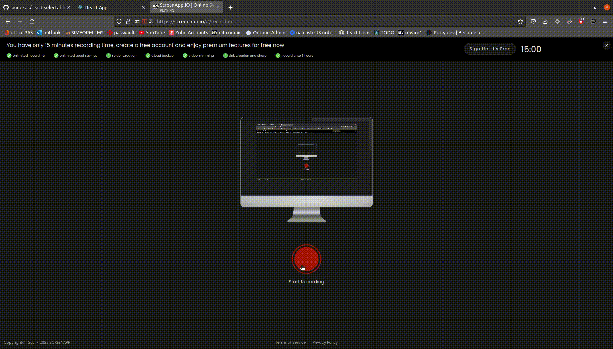

 ## You can hold your mouse and drag to draw selectable area.
 ## You can add function which will execute whenever your component intersect with selectable area.
 ### Made without using any third party library

